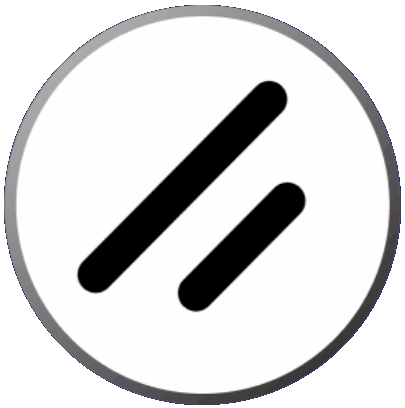
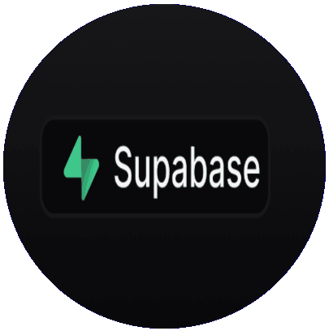
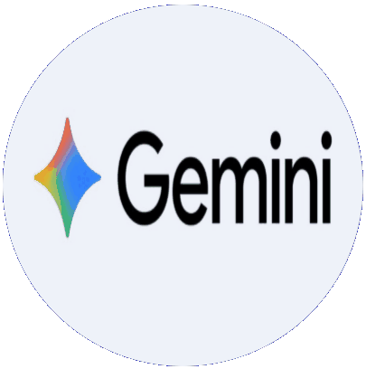
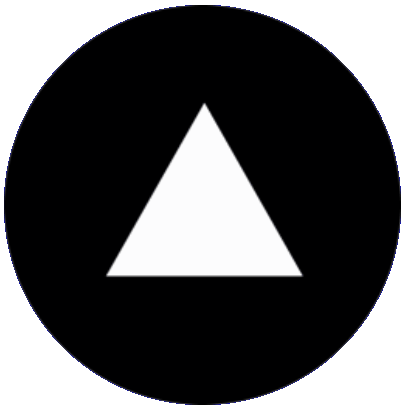

  
  <h2 style="margin: 0;">“TaskM” - Task Manager / ToDo Web App with Auth, UI, DB, and AI</h2>

  
TaskM is a simple, elegant task manager built with user authentication, a modern UI, AI-assisted task suggestions, and a connected database, all deployed and ready to use.

<a href="https://task-m-three.vercel.app" target="_blank" style="
  display: inline-block;
  padding: 0.5em 1em;
  background-color: #1e293d;
  color: white;
  border-radius: 6px;
  text-decoration: none;
  font-weight: bold;
  font-family: sans-serif;
">Try TaskM's Live Demo →</a>

  <h3>Built with:</h3>
  

    
    
    
    
    
    
    

  

 

- **Next.js** + **Tailwind CSS** - frontend framework and utility-first styling
- **shadcn/ui** - modern component library
- **Supabase** - auth, database, and storage
- **Gemini API** - for AI-based task breakdowns
- **Framer Motion** - for UI animations
- **Vercel** - for fast, production-grade deployment

<h2>Features</h2>

| Feature                                          | Tools to Learn/Use                       |
| ------------------------------------------------ | ---------------------------------------- |
| Sign up / Sign in                                | Supabase Auth + shadcn/ui Inputs/Dialogs |
| Create/edit/delete task                          | Supabase DB (PostgreSQL)                 |
| Tag tasks as “Todo”, “In Progress”, “Done”       | UI logic + DB updates                    |
| Filter/search tasks                              | Tailwind forms + query filters           |
| AI: Breaks down high-level tasks into mini tasks | Gemini API (text generation)             |
| Dark mode toggle                                 | Next.js Dark mode                        |

<h2>Light Mode</h2>

  

<h2>Dark Mode</h2>

  

   
This project is supposed to be a one week sprint project for learning Next.js

<a href="PLAN.md" target="_blank" style="
    display: inline-block;
    padding: 0.5em 1em;
    background-color: #1e293d;
    color: white;
    border-radius: 6px;
    text-decoration: none;
    font-weight: bold;
    font-family: sans-serif;
  ">See One-Week Sprint Plan →</a>

  <h4 style="text-align: end">Developed by Christopher A. Quinto</h4>

